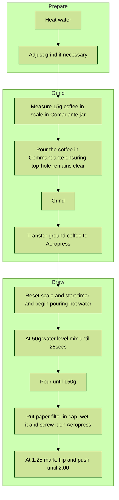

{.flex .items-center .justify-center}

```mermaid
%%{init: {'theme': 'forest', "flowchart" : { "curve" : "basis" } } }%%
graph TD;
    subgraph Prepare
    stove[Heat water]-->grindadj[Adjust grind if necessary];
    end
    subgraph Grind
    grindadj-->measure[Measure 15g coffee in scale in Comadante jar];
    measure-->pour[Pour the coffee in Commandante ensuring top-hole remains clear];
    pour-->grind[Grind];
    grind-->tr[Transfer ground coffee to Aeropress];
    end
    subgraph Brew
    tr-->timer[Reset scale and start timer and begin pouring hot water]
    timer-->mix[At 50g water level mix until 25secs]
    mix-->w[Pour until 150g]
    w-->cap[Put paper filter in cap, wet it and screw it on Aeropress]
    cap-->flip["At 1:25 mark, flip and push until 2:00"]
    end
```

[ ] Clean this up (needs to be a graph than list for one thing).